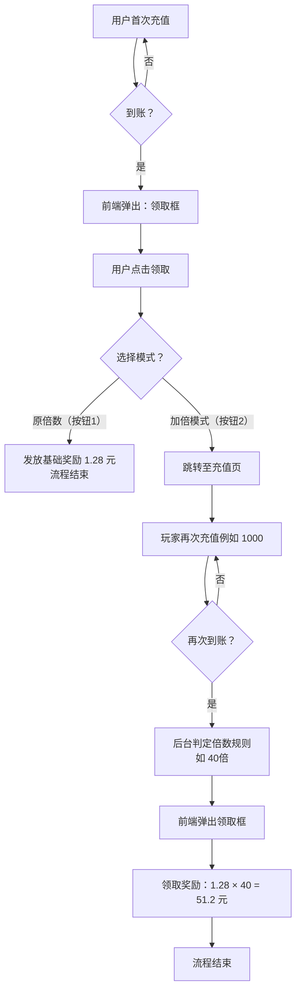

```mermaid
flowchart TD

A[用户首次充值] --> B{到账？}
B -- 否 --> A
B -- 是 --> C[前端弹出：领取框]

C --> D[用户点击领取]
D --> E{选择模式？}

E -- 原倍数（按钮1） --> F[发放基础奖励 1.28 元<br>流程结束]

E -- 加倍模式（按钮2） --> G[跳转至充值页]

G --> H[玩家再次充值例如 1000]
H --> I{再次到账？}
I -- 否 --> H
I -- 是 --> J[后台判定倍数规则<br>如 40倍]

J --> K[前端弹出领取框]
K --> L[领取奖励：1.28 × 40 = 51.2 元]
L --> M[流程结束]
```