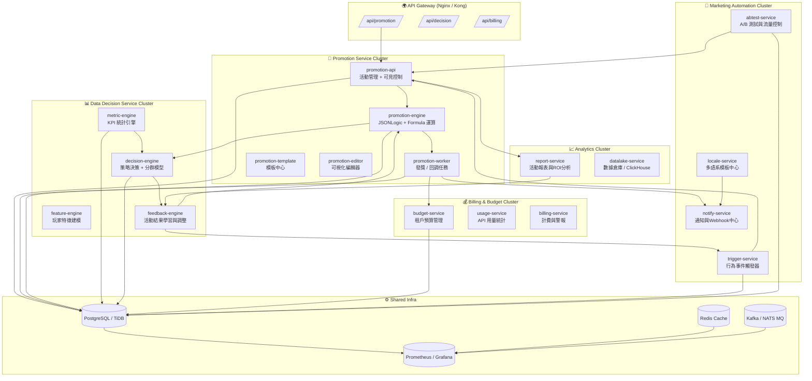

| 類別                    | 微服務名稱                | 核心職責             | 技術要點                        |
| --------------------- | -------------------- | ---------------- | --------------------------- |
| **Promotion Service** | `promotion-api`      | 活動 CRUD、可見條件     | JWT + gRPC + JSONLogic      |
|                       | `promotion-engine`   | 參與 / 符合 / 奬勵公式運算 | Govaluate + Lua             |
|                       | `promotion-worker`   | 發獎與回調任務          | MQ 消費 + 錢包 API              |
|                       | `promotion-template` | 模板中心             | JSON Schema + 快速生成          |
|                       | `promotion-editor`   | 視覺化邏輯編輯器         | Blockly / Vue Builder       |
| **Decision Service**  | `metric-engine`      | 指標統計：ROI / 留存    | ClickHouse / SQL 聚合         |
|                       | `feature-engine`     | 玩家特徵嵌入建模         | Python + ML Pipeline        |
|                       | `decision-engine`    | 策略決策與分群          | XGBoost / JSONLogic         |
|                       | `feedback-engine`    | 活動結果回饋訓練         | Auto-Tuning / Reinforcement |
| **Billing Service**   | `budget-service`     | 預算上限 + 鎖單        | Redis 鎖定 / 監控警報             |
|                       | `usage-service`      | API 使用統計         | gRPC Middleware             |
|                       | `billing-service`    | 成本計算與通知          | CRON + Telegram Alert       |
| **Marketing Service** | `trigger-service`    | 行為事件觸發           | Kafka / Event Bus           |
|                       | `abtest-service`     | A/B 測試與流量控制      | 分流演算法 / Redis Hash          |
|                       | `locale-service`     | 多語模板             | i18n JSON + 動態替換            |
|                       | `notify-service`     | 通知中心             | OneSignal / SMTP / Webhook  |
| **Analytics Service** | `report-service`     | 成效報表與ROI分析       | Grafana / CSV Export        |
|                       | `datalake-service`   | 數據倉庫整合           | TiDB + ClickHouse ETL       |

資料流與事件流設計
📥 Data Flow

promotion-api 收到活動事件

promotion-engine 進行條件運算

worker 將結果寫入 MQ

decision-engine 同步更新 KPI 模型

billing-service 計算成本與預算消耗

report-service 彙總指標 → 供 dashboard 顯示

topic: promotion.event.join
topic: promotion.event.reward
topic: decision.update.model
topic: billing.budget.alert
topic: trigger.user.deposit
