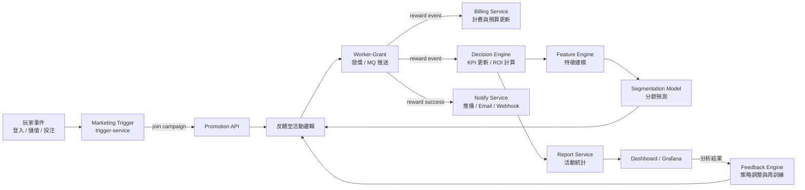

```mermaid
flowchart LR

A[玩家事件<br>登入 / 儲值 / 投注] 
--> B[Marketing Trigger<br>trigger-service]

B -->|join campaign| C[Promotion API]
C --> D[Promotion Engine<br>條件判斷 + 公式]
D --> E[Worker-Grant<br>發獎 / MQ 推送]

E -->|reward event| F1[Billing Service<br>計費與預算更新]
E -->|reward event| F2[Decision Engine<br>KPI 更新 / ROI 計算]
E -->|reward success| F3[Notify Service<br>推播 / Email / Webhook]

F2 --> G1[Feature Engine<br>特徵建模]
F2 --> G2[Report Service<br>活動統計]
G1 --> G3[Segmentation Model<br>分群預測]
G3 --> D[反饋至活動邏輯]
G2 --> H[Dashboard / Grafana]

H -->|分析結果| I[Feedback Engine<br>策略調整與再訓練]
I --> D
```