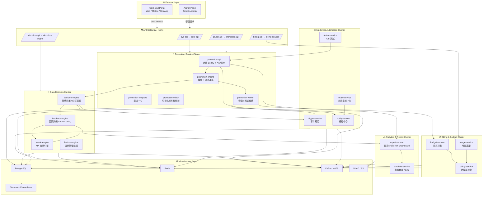

```mermaid

graph TD

subgraph EXT["🌐 External Layer"]
  U1[Front-End Portal<br>Web / Mobile / MiniApp]
  U2[Admin Panel<br>Simple-Admin]
end

subgraph GATE["🌍 API Gateway / Nginx"]
  G1[/sys-api → core-api/]
  G2[/plusin-api → promotion-api/]
  G3[/decision-api → decision-engine/]
  G4[/billing-api → billing-service/]
end

subgraph PROMO["🎯 Promotion Service Cluster"]
  P1[promotion-api<br>活動 CRUD + 可見控制]
  P2[promotion-engine<br>條件 + 公式運算]
  P3[promotion-worker<br>發獎 / 回調任務]
  P4[promotion-template<br>模板中心]
  P5[promotion-editor<br>可視化條件編輯器]
end

subgraph DECISION["🧠 Data Decision Cluster"]
  D1[metric-engine<br>KPI 統計引擎]
  D2[feature-engine<br>玩家特徵建模]
  D3[decision-engine<br>策略決策 / 分群模型]
  D4[feedback-engine<br>回饋訓練 + AutoTuning]
end

subgraph BILLING["💰 Billing & Budget Cluster"]
  B1[budget-service<br>預算控制]
  B2[usage-service<br>用量追蹤]
  B3[billing-service<br>結算與預警]
end

subgraph MARKETING["📢 Marketing Automation Cluster"]
  M1[trigger-service<br>事件觸發]
  M2[abtest-service<br>A/B 測試]
  M3[locale-service<br>多語模板中心]
  M4[notify-service<br>通知中心]
end

subgraph ANALYTICS["📈 Analytics & Report Cluster"]
  R1[report-service<br>報表分析 / ROI Dashboard]
  R2[datalake-service<br>數據倉庫 / ETL]
end

subgraph INFRA["⚙️ Infrastructure Layer"]
  DB[PostgreSQL]
  CACHE[Redis]
  MQ[Kafka / NATS]
  OBS[MinIO / S3]
  MON[Grafana + Prometheus]
end

%% External -> Gateway
U1 -->|JWT / REST| GATE
U2 -->|管理請求| GATE

%% Gateway -> Clusters
G1 --> PROMO
G2 --> PROMO
G3 --> DECISION
G4 --> BILLING

%% Promotion relations
P1 --> P2 --> P3 --> M4
P2 --> D3
P3 --> B1

%% Decision relations
D1 --> D3 --> D4 --> D1
D3 --> M1
D4 --> R1

%% Marketing relations
M1 --> P1
M2 --> P1
M3 --> M4

%% Billing relations
B1 --> B3
B2 --> B3

%% Analytics
P1 --> R1
R1 --> R2

%% Infra connections
PROMO & DECISION & BILLING & MARKETING & ANALYTICS --> DB
PROMO & DECISION & BILLING & MARKETING & ANALYTICS --> CACHE
PROMO & DECISION & BILLING & MARKETING & ANALYTICS --> MQ
ANALYTICS --> OBS
INFRA --> MON

```