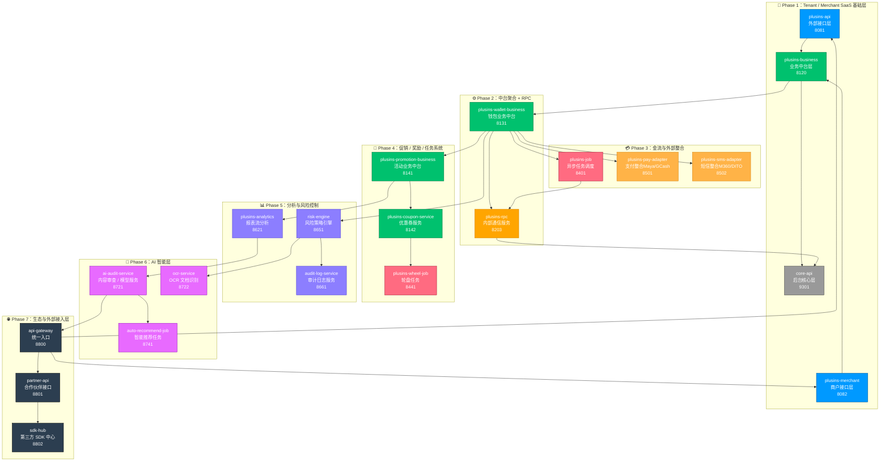

```mermaid
graph TD
  %% ============================
  %% PHASE 1 – 核心商户 SaaS 层
  %% ============================
  subgraph Phase1["🏢 Phase 1：Tenant / Merchant SaaS 基础层"]
    A1[plusins-api<br>外部接口层<br>8081]:::api
    A2[plusins-merchant<br>商户接口层<br>8082]:::api
    B1[plusins-business<br>业务中台层<br>8120]:::business
    C1[core-api<br>后台核心层<br>9301]:::core
  end
  A1 --> B1
  A2 --> B1
  B1 --> C1

  %% ============================
  %% PHASE 2 – 中台聚合与 RPC 通信
  %% ============================
  subgraph Phase2["⚙️ Phase 2：中台聚合 + RPC"]
    B2[plusins-wallet-business<br>钱包业务中台<br>8131]:::business
    R1[plusins-rpc<br>内部通信服务<br>8203]:::rpc
  end
  B1 --> B2
  B2 --> R1
  R1 --> C1

  %% ============================
  %% PHASE 3 – 金流 / Job / Integration
  %% ============================
  subgraph Phase3["💳 Phase 3：金流与外部整合"]
    J1[plusins-job<br>异步任务调度<br>8401]:::job
    I1[plusins-pay-adapter<br>支付整合Maya/GCash<br>8501]:::integration
    I2[plusins-sms-adapter<br>短信整合M360/DITO<br>8502]:::integration
  end
  B2 --> J1
  B2 --> I1
  B2 --> I2
  J1 --> R1

  %% ============================
  %% PHASE 4 – 活动与促销系统
  %% ============================
  subgraph Phase4["🎁 Phase 4：促销 / 奖励 / 任务系统"]
    P1[plusins-promotion-business<br>活动业务中台<br>8141]:::business
    P2[plusins-coupon-service<br>优惠券服务<br>8142]:::business
    P3[plusins-wheel-job<br>轮盘任务<br>8441]:::job
  end
  B2 --> P1
  P1 --> P2
  P2 --> P3

  %% ============================
  %% PHASE 5 – 数据与风控层
  %% ============================
  subgraph Phase5["📊 Phase 5：分析与风险控制"]
    D1[plusins-analytics<br>报表流分析<br>8621]:::analytics
    D2[risk-engine<br>风险策略引擎<br>8651]:::analytics
    D3[audit-log-service<br>审计日志服务<br>8661]:::analytics
  end
  P1 --> D1
  B2 --> D2
  D2 --> D3

  %% ============================
  %% PHASE 6 – AI 智能与 OCR 审查
  %% ============================
  subgraph Phase6["🧠 Phase 6：AI 智能层"]
    AI1[ai-audit-service<br>内容审查 / 模型服务<br>8721]:::ai
    AI2[ocr-service<br>OCR 文档识别<br>8722]:::ai
    AI3[auto-recommend-job<br>智能推荐任务<br>8741]:::ai
  end
  D1 --> AI1
  D2 --> AI2
  AI1 --> AI3

  %% ============================
  %% PHASE 7 – 生态 / 对外开放层
  %% ============================
  subgraph Phase7["🌐 Phase 7：生态与外部接入层"]
    G1[api-gateway<br>统一入口<br>8800]:::gateway
    G2[partner-api<br>合作伙伴接口<br>8801]:::gateway
    G3[sdk-hub<br>第三方 SDK 中心<br>8802]:::gateway
  end
  G1 --> G2
  G2 --> G3
  G1 --> A1
  G1 --> A2
  AI1 --> G1

  %% ============================
  %% 样式定义
  %% ============================
  classDef api fill:#0099ff,stroke:#004b87,color:#fff
  classDef business fill:#00c16e,stroke:#006b3f,color:#fff
  classDef rpc fill:#ffa500,stroke:#cc7a00,color:#fff
  classDef job fill:#ff6b81,stroke:#a10024,color:#fff
  classDef integration fill:#ffb347,stroke:#d07a00,color:#fff
  classDef analytics fill:#8c7eff,stroke:#4b3fcf,color:#fff
  classDef ai fill:#e86aff,stroke:#8a0cb3,color:#fff
  classDef core fill:#999999,stroke:#333,color:#fff
  classDef gateway fill:#2c3e50,stroke:#000,color:#fff


```