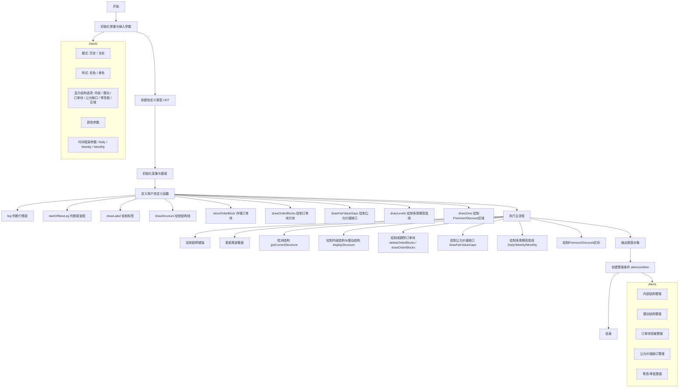

```mermaid
flowchart TD
    A[开始] --> B[初始化常量与输入参数]
    B --> C[创建自定义类型 UDT]
    C --> D[初始化变量与数组]
    D --> E[定义用户自定义函数]
    
    E --> E1[leg 判断行情段]
    E --> E2[startOfNewLeg 判断新波段]
    E --> E3[drawLabel 绘制标签]
    E --> E4[drawStructure 绘制结构线]
    E --> E5[storeOrderBlock 存储订单块]
    E --> E6[drawOrderBlocks 绘制订单块方块]
    E --> E7[drawFairValueGaps 绘制公允价值缺口]
    E --> E8[drawLevels 绘制多周期高低线]
    E --> E9[drawZone 绘制Premium/Discount区域]

    E --> F[执行主流程]
    
    F --> F1[绘制趋势蜡烛]
    F --> F2[更新尾部极值]
    F --> F3[检测结构: getCurrentStructure]
    F --> F4[绘制内部结构与摆动结构 displayStructure]
    F --> F5[绘制或删除订单块 deleteOrderBlocks / drawOrderBlocks]
    F --> F6[绘制公允价值缺口 drawFairValueGaps]
    F --> F7[绘制多周期高低线 Daily/Weekly/Monthly]
    F --> F8[绘制Premium/Discount区间]

    F --> G[输出图表对象]
    G --> H[创建警报条件 alertcondition]
    H --> I[结束]

    subgraph Inputs
        B1[模式: 历史 / 当前]
        B2[样式: 彩色 / 单色]
        B3[显示结构选项: 内部 / 摆动 / 订单块 / 公允缺口 / 等高低 / 区域]
        B4[颜色参数]
        B5[时间框架参数: Daily / Weekly / Monthly]
    end
    B --> Inputs

    subgraph Alerts
        H1[内部结构警报]
        H2[摆动结构警报]
        H3[订单块突破警报]
        H4[公允价值缺口警报]
        H5[等高/等低警报]
    end
    H --> Alerts

```